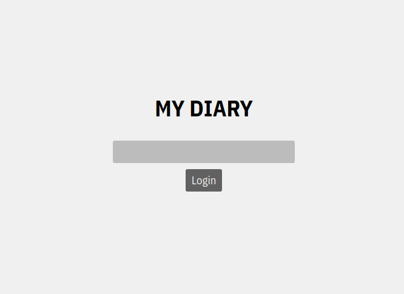
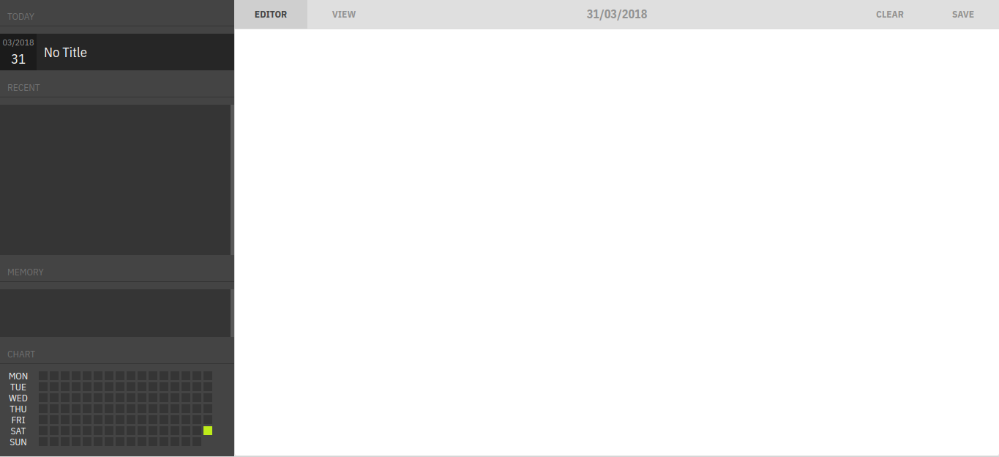
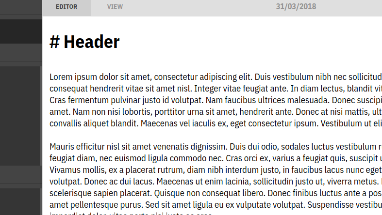

# My-Diary

_Keep your memory in tool._

## Usage

Open your terminal (command line) and typing this.

```
$ git clone https://github.com/vuanhhaogk/My-Diary.git && cd My-Diary
$ npm i
$ node index
```

When you see message:

```
Server running at port 5000
```

Open your browser with url: [http://localhost:5000](http://localhost:5000), type your new password and start.

## Gallery

Login page.




Your workpage.



Using markdown to typing.



## License

MIT